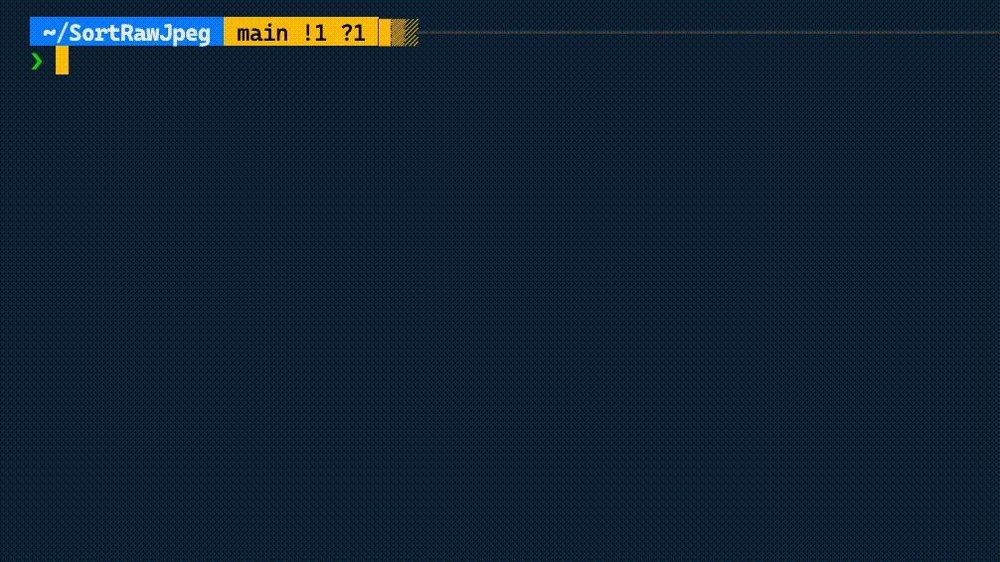
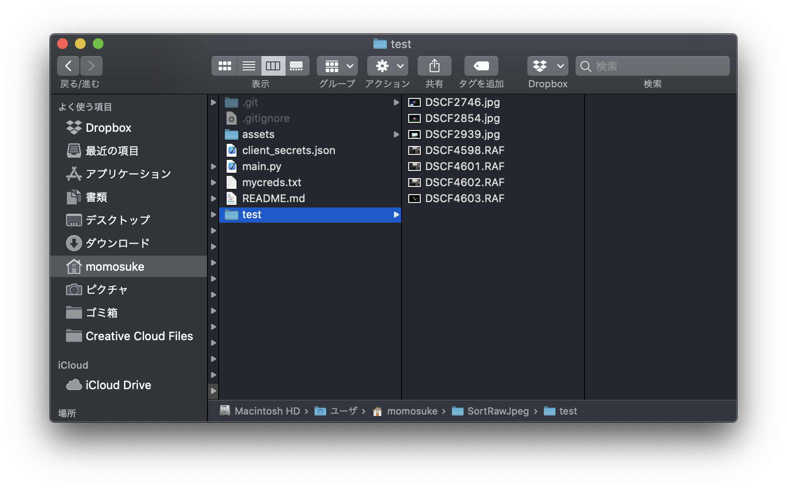
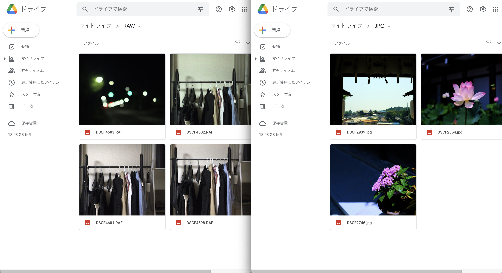

# SortRawJpeg

`RAW`と`JPEG`が混ざったローカルフォルダから，それぞれをGoogleDrive上の別のフォルダにアップロードする写真管理用プログラム
# Demo







# Requirement

手元の実行環境

* Python 3.7.3
* PyDrive 1.3.1

> PyDrive is a wrapper library of google-api-python-client that simplifies many common Google Drive API tasks.[出典](https://pythonhosted.org/PyDrive/)

# Installation

PyDriveライブラリのインストール

```bash
pip install PyDrive
```

# Usage


```bash
git clone https://github.com/ry0y4n/SortRawJpeg
python main.py
```

# Note

* `raw_ext`にはお使いのカメラがRAWデータの拡張子を設定してください（著者は富士フィルムなので`.RAF`）．
* `raw_folder_id`と`jpg_folder_id`はそれぞれGoogleDrive上のRAW・JPEG用フォルダのフォルダIDに置き換えてください．フォルダIDとはブラウザでフォルダを開いた時のURLの最後の部分です（詳しくは[2]を参考）．

# Reference

* [[1] PythonでGoogle Driveにファイルをアップロードする](https://laboratory.kazuuu.net/upload-files-to-google-drive-with-python/)
* [[2] PythonでGoogleドライブに画像をアップロード](https://qiita.com/akabei/items/f25e4f79dd7c2f754f0e#%E3%83%97%E3%83%AD%E3%82%B0%E3%83%A9%E3%83%A0%E5%AE%9F%E8%A1%8C)
